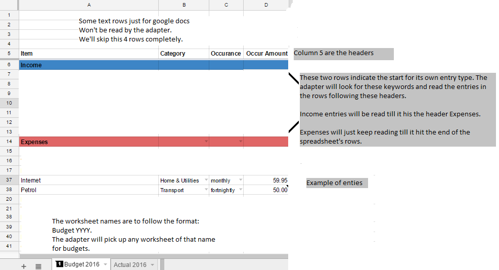

# Piggy Monitor

No we're not monitoring a piglet's growth.

We're monitoring our piggybank!

This will be an educational experiment for me to learn Ruby and at the same time do some household management.

So expect to see lots of fyi/reference-type comments for educational knowledge.

## What's involved

This is a ruby API service using Sinatra as the base.

Connected to Google Drive through [goodle-drive-ruby](https://github.com/gimite/google-drive-ruby).

Using rake to build my test.

## Starting the endpoint service

Sinatra just sits on top of rack. So why not utilize its simple startup process; thus the use of config.ru.

`rackup`

<small>fyi about rack: If you don't specify an environment, development is used by default. Specify then environment by including parameter `-E <ENV_NAME>`. If you specify an environment that you don't configure, no configuration block will match.</small>

### Run as development

**Unforunately 2.2.4 is buggy for guard so just use rackup**

Using [Guard](https://github.com/guard/guard) for in-process automated re-launching of rack.
`bundle exec guard`

## Run spec test

`rake test`

## The Database

The database is a spreadsheet on google docs, formatted by preference of my SO.
So that's the limitation I have to work with but that's fine with me.

If this ever kicks off well with her, the spreadsheet can be changed to something more of a database structure.

Note: the amounts should be in pure numeric text.

This is the, strict, spreadsheet layout

